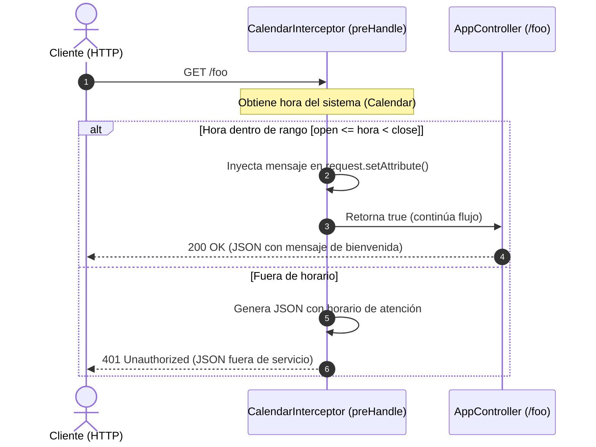

# 🕒 Spring Boot - Control de Horario con Interceptores (Spring MVC)


API REST desarrollada con **Spring Boot** que implementa un mecanismo de control de acceso por franja horaria mediante **HTTP Handlers Interceptors** (`HandlerInterceptor`). El sistema evalúa en tiempo real si las solicitudes a determinados endpoints se encuentran dentro del horario de atención configurado o si deben ser rechazadas con una respuesta estructurada en formato JSON.

---

## 📌 Tabla de Contenidos

- [Características](#-características)
- [Arquitectura y Flujo](#-arquitectura-y-flujo)
- [Tecnologías Utilizadas](#-tecnologías-utilizadas)
- [Requisitos Previos](#-requisitos-previos)
- [Configuración](#-configuración)
- [Instalación y Ejecución](#-instalación-y-ejecución)
- [Endpoints y Pruebas](#-endpoints-y-pruebas)
- [Estructura del Proyecto](#-estructura-del-proyecto)
- [Contribuciones y Licencia](#-licencia)

---

## ✨ Características

- ⏱️ **Filtro por franja horaria**: Restringe el acceso a endpoints específicos dependiendo de la hora actual del servidor.
- 🛡️ **Uso de Interceptores (`HandlerInterceptor`)**: Validación centralizada en la fase `preHandle` antes de alcanzar el controlador.
- ⚙️ **Configuración desacoplada**: Horas de apertura y cierre parametrizables desde `application.properties`.
- 📦 **Respuestas estandarizadas**:
  - **Dentro de horario**: El interceptor adjunta metadatos al `HttpServletRequest` y el controlador responde con estado `200 OK`.
  - **Fuera de horario**: El interceptor interrumpe el ciclo de vida, respondiendo directamente con estado `401 Unauthorized` y payload JSON informativo.

---

## 🔄 Arquitectura y Flujo

El interceptor intercepta las peticiones dirigidas a la ruta mapeada (`/foo`), inspecciona la hora del sistema y decide si permitir el paso al controlador o terminar la petición:



---

## 🛠️ Tecnologías Utilizadas

- **Lenguaje:** Java 21
- **Framework:** Spring Boot (Spring MVC, Actuator, DevTools)
- **Serialización:** Jackson Databind
- **Gestor de Dependencias:** Apache Maven
- **Entorno:** Spring Web MVC

---

## 📋 Requisitos Previos

- **Java JDK 21** o superior instalado.
- **Git** instalado en tu sistema.
- Un cliente HTTP para pruebas (como [Postman](https://www.postman.com/), [cURL](https://curl.se/) o el navegador web).

---

## ⚙️ Configuración

Las variables de apertura y cierre de atención al cliente se definen en `src/main/resources/application.properties`:

```properties
# Nombre de la aplicación
spring.application.name=springboot-horario

# Horario en formato de 24 horas (ejemplo: 14:00 a 18:00)
config.calendar.open=14
config.calendar.close=18
```

> [!TIP]
> Para probar fácilmente ambos escenarios (dentro y fuera de horario), ajusta los valores de `config.calendar.open` y `config.calendar.close` para que incluyan o excluyan la hora actual de tu ordenador.

---

## 🚀 Instalación y Ejecución

1. **Clonar el repositorio:**
   ```bash
   git clone https://github.com/GusDev071/Horario-con-interceptores---Springboot.git
   cd Horario-con-interceptores---Springboot
   ```

2. **Compilar y empaquetar el proyecto:**
   - En Linux/macOS:
     ```bash
     ./mvnw clean package
     ```
   - En Windows (PowerShell / CMD):
     ```powershell
     .\mvnw.cmd clean package
     ```

3. **Ejecutar la aplicación:**
   - Con Maven Wrapper:
     ```powershell
     .\mvnw.cmd spring-boot:run
     ```
   - O ejecutando el archivo `.jar` generado:
     ```bash
     java -jar target/springboot-horario-0.0.1-SNAPSHOT.jar
     ```

Por defecto, la aplicación estará disponible en `http://localhost:8080`.

---

## 📡 Endpoints y Pruebas

### 📍 `GET /foo`

Endpoint de prueba protegido por `CalendarInterceptor`.

#### Caso 1: Dentro de horario de atención (`200 OK`)

Si la hora actual del servidor está comprendida entre `config.calendar.open` y `config.calendar.close`:

```bash
curl -X GET http://localhost:8080/foo
```

**Respuesta:**
```json
{
  "title": "Bienvenidos al sistema de atencion!",
  "time": "2026-09-29T15:30:00.000+00:00",
  "message": "Bienvenido al horario de atencion a clientes!!. Atendemos desde las 14 hrs. hasta las 18 hrs. GRACIAS POR SU VISITA!!"
}
```

---

#### Caso 2: Fuera de horario de atención (`401 Unauthorized`)

Si la petición se realiza fuera del intervalo configurado:

```bash
curl -i -X GET http://localhost:8080/foo
```

**Respuesta:**
```http
HTTP/1.1 401 Unauthorized
Content-Type: application/json
```
```json
{
  "date": "Tue Sep 29 19:15:22 CST 2026",
  "message": "Cerrado, horario fuera de servicio. Por favor vuelva mañana, en un horario de 14 hrs. hasta las 18 hrs. GRACIAS POR SU VISITA!!"
}
```

---

## 📂 Estructura del Proyecto

```plaintext
springboot-horario/
├── src/
│   ├── main/
│   │   ├── java/com/gustavo/curso/springboot/calendar/interceptor/springboot_horario/
│   │   │   ├── SpringbootHorarioApplication.java   # Clase principal de arranque
│   │   │   ├── MvcConfig.java                      # Registro y configuración de interceptores
│   │   │   ├── controllers/
│   │   │   │   └── AppController.java              # Controlador REST de ejemplo (/foo)
│   │   │   └── interceptors/
│   │   │       └── CalendarInterceptor.java        # Lógica de validación de horario (HandlerInterceptor)
│   │   └── resources/
│   │       ├── application.properties             # Parámetros de configuración de horario
│   │       └── META-INF/                          # Metadatos adicionales de configuración
│   └── test/                                      # Pruebas unitarias y de integración
├── pom.xml                                        # Dependencias Maven y configuración del build
└── README.md                                      # Documentación del proyecto
```

---

## 📄 Licencia

Este proyecto se distribuye bajo fines educativos y de aprendizaje. Siéntete libre de utilizarlo y modificarlo según tus necesidades.
